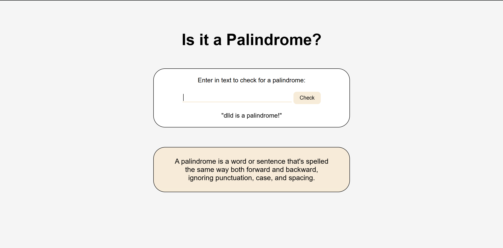

# palindrome-checker

A simple web application that checks whether a given word or sentence is a palindrome — a sequence that reads the same backward as forward, ignoring punctuation, case, and spacing.

# image

